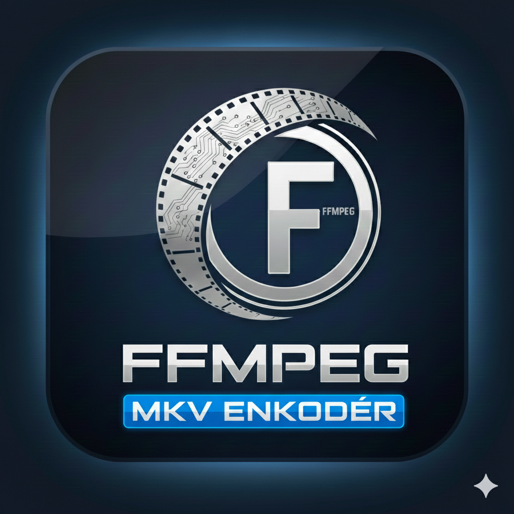

<p align="center">
  
</p>
<p align="center">
  <a href="https://www.paypal.com/paypalme/DaTTcz">
    
  </a>
  &nbsp;&nbsp;
  <a href="https://ko-fi.com/dattcz">
    
  </a>
</p>

# FFMPEG Master

Desktopová Windows aplikace (Python + CustomTkinter) pro dávkovou konverzi videa přes **FFmpeg** — hromadné překódování do HEVC (NVENC), výběr audio/titulkových stop, normalizace hlasitosti (loudnorm, 2-průchodová analýza), generování NFO a přesun/přejmenování zpracovaných souborů.

Aktuální verze: **v0.5**. Historie změn viz [CHANGELOG.md](CHANGELOG.md).

## Funkce (v0.5)

- Drag & drop i výběr souborů, fronta ke zpracování s možností řazení (nahoru/dolů) a mazání položek
- **Dialog výběru stop** při přidání každého souboru — tabulka audio/titulkových stop (kodek, jazyk, kanály, bitrate, název), checkboxy s auto-výběrem podle nastavených jazyků, varování u obrázkových PGS titulků, tlačítko „Výchozí výběr“
- **`config.json`** vedle programu — cesty k `ffmpeg`/`ffprobe`, výstupní/cílová složka, CQ/preset/rozlišení, audio bitrate, parametry `loudnorm`, generování NFO, chování se zdrojovým souborem (přesun/přejmenování/ponechat), motiv, uložená geometrie okna
- **Menu lišta**: Nastavení (editace `config.json` z UI) a O programu (verze, logo, kontakt, kontrola aktualizací)
- **Kontrola aktualizací z GitHub Releases** — tichá kontrola při startu s nenápadným oznámením, manuální kontrola i stažení/instalace nového `.exe`
- Překódování do HEVC (`hevc_nvenc`, 10bit `p010le`), parametry CQ/preset/rozlišení podle configu
- Normalizace hlasitosti dvouprůchodovým `loudnorm` s fallbackem na 1-průchodový režim
- **NFO generátor** s editovatelným titulem, rokem, žánrem (dropdown z configu) a plotem
- Log průběhu, progress bar na soubor i celkový, zvukové upozornění po dokončení
- Splash screen s logem při startu

## Požadavky

- Windows (používá `ctypes`/`shell32` pro ikonu v liště a NVENC hardwarové kódování)
- Nainstalovaný [FFmpeg](https://ffmpeg.org/) (`ffmpeg.exe`, `ffprobe.exe`)
- Python 3.10+ s balíčky: `customtkinter`, `tkinterdnd2`, `Pillow` (volitelně, pro splash logo a about dialog)
- GPU s podporou NVENC (HEVC) pro hardwarové kódování

```bash
pip install customtkinter tkinterdnd2 pillow
```

## Spuštění

```bash
python FFMPEG_Master_v0_5.pyw
```

Při prvním spuštění se vedle scriptu (nebo vedle `.exe`, viz [BUILD.md](BUILD.md)) vytvoří `config.json` s výchozími hodnotami — uprav si ho přes menu **Nastavení** v aplikaci, nebo ručně (vzor v [config.example.json](config.example.json)).

## Sestavení do .exe

Viz [BUILD.md](BUILD.md) — PyInstaller `--onefile` build, `config.json` zůstává editovatelný vedle exe, publikování na GitHub Releases pro fungování auto-update.

## Licence

Tento projekt je licencován pod [PolyForm Noncommercial License 1.0.0](LICENSE) — volné použití pro nekomerční účely (osobní, výzkumné, vzdělávací atd.), komerční použití vyžaduje samostatnou licenci od autora.
