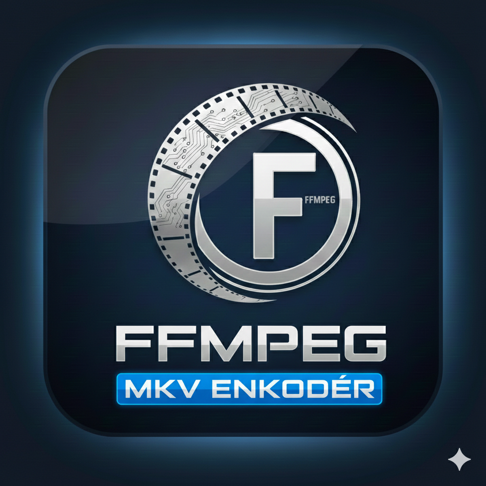

<p align="center">
  
</p>
<p align="center">
  <a href="https://www.paypal.com/paypalme/DaTTcz">
    
  </a>
  &nbsp;&nbsp;
  <a href="https://ko-fi.com/dattcz">
    
  </a>
</p>

# FFMPEG Master

Desktopová aplikace pro Windows i Linux (Python + CustomTkinter) pro dávkovou konverzi videa přes **FFmpeg** — hromadné překódování do HEVC (NVENC na Windows, na Linuxu i software/VA-API kodeky), výběr audio/titulkových stop, normalizace hlasitosti (loudnorm, 2-průchodová analýza), generování NFO a přesun/přejmenování zpracovaných souborů.

## Funkce

- Drag & drop i výběr souborů, fronta ke zpracování s možností řazení (nahoru/dolů), úpravy (tlačítko „Upravit“) a mazání položek
- **Dialog výběru stop** při přidání i úpravě každého souboru — tabulka audio/titulkových stop (kodek, jazyk, kanály, bitrate, název), checkboxy s auto-výběrem podle nastavených jazyků, varování u obrázkových PGS titulků, tlačítko „Výchozí výběr“, volitelné per-soubor vypnutí NFO a „Kopírovat video beze změny“ pro poškozené/problematické zdroje
- **`config.json`** vedle programu — cesty k `ffmpeg`/`ffprobe`, výstupní/cílová složka, CQ/preset/rozlišení, audio bitrate, parametry `loudnorm`, generování NFO, chování se zdrojem zvlášť pro lokální a síťové disky (přesun/přejmenování/ponechat), motiv, uložená geometrie okna
- **Menu lišta**: Nastavení (editace `config.json` z UI, včetně přepínače na vlastní FFmpeg příkaz) a O programu (verze, logo, kontakt, kontrola aktualizací)
- **Kontrola aktualizací z GitHub Releases** — tichá kontrola při startu s nenápadným oznámením, manuální kontrola i stažení/instalace nové verze (Windows `.exe`, Linux AppImage, `.deb` i `.rpm`)
- Překódování do HEVC (`hevc_nvenc`, 10bit `p010le`), parametry CQ/preset/rozlišení podle configu, nebo plně vlastní FFmpeg parametry
- Normalizace hlasitosti dvouprůchodovým `loudnorm` samostatně pro každou vybranou audio stopu (down-mix na stereo → přesné změření → normalizace), s fallbackem na 1-průchodový režim
- **NFO generátor** s editovatelným titulem, rokem, žánrem (dropdown z configu) a plotem, volitelně vypnutelný pro konkrétní soubor
- Log průběhu (včetně hlášek o jednotlivých průchodech), progress bar na soubor i celkový, zvukové upozornění po dokončení

## Stažení hotové verze (doporučeno)

Na [stránce vydání](https://github.com/DaTTcz/FFMPEG-Master/releases/latest) jsou ke stažení čtyři soubory pro každou verzi:

| Soubor | Pro koho |
|---|---|
| **`FFMPEG_Master.exe`** | Windows |
| **`FFMPEG_Master_<verze>_amd64.deb`** | Debian, Ubuntu, Mint, Pop!_OS… — `sudo apt install ./FFMPEG_Master_*_amd64.deb` (doinstaluje i `ffmpeg`) |
| **`FFMPEG_Master-<verze>.x86_64.rpm`** | Fedora, openSUSE — `sudo dnf install ./FFMPEG_Master-*.rpm`, resp. `sudo zypper install --allow-unsigned-rpm ./FFMPEG_Master-*.rpm` |
| **`FFMPEG_Master-x86_64.AppImage`** | jakákoliv jiná distribuce (Arch…) nebo bez instalace — stačí `chmod +x` a spustit |

Linuxové verze potřebují distribuci s glibc 2.39 nebo novější (Ubuntu 24.04+, Mint 22+, Debian 13+, aktuální Fedora, openSUSE Tumbleweed/Slowroll, Arch). Každé vydání se před zveřejněním automaticky testuje na Ubuntu 24.04 a 26.04, Debianu 13, Fedoře, openSUSE Tumbleweed a Archu.

**Fedora / openSUSE:** oficiální `ffmpeg` z repozitářů distribuce kvůli patentům neumí H.264/HEVC ani NVENC. Pro plnou funkčnost přepni ffmpeg na verzi z [RPM Fusion](https://rpmfusion.org/) (Fedora), resp. z Packmanu (openSUSE: `sudo zypper install opi && opi codecs`).

Pokud aplikace hlásí, že nejde analyzovat soubor, v logu je teď i konkrétní důvod. Pro diagnostiku jde spustit i bez GUI: `ffmpeg-master --selftest cesta/k/videu.mkv` (u AppImage `./FFMPEG_Master-x86_64.AppImage --selftest ...`).

## Požadavky

- Windows nebo Linux
- Nainstalovaný [FFmpeg](https://ffmpeg.org/) — na Windows `ffmpeg.exe`/`ffprobe.exe` (výchozí cesta `C:\FFMPEG\bin\...`, upravitelná v Nastavení), na Linuxu se očekává `ffmpeg`/`ffprobe` v `PATH`
- Python 3.10+ s balíčky ze `requirements.txt` (`customtkinter`, `tkinterdnd2`, `pillow`) — na Linuxu navíc systémový Tk/Tcl (`sudo apt install python3-tk tk-dev` na Debianu/Ubuntu) — **jen pro spuštění ze zdrojového `.pyw`**, hotové binárky/balíčky výše si vše potřebné nesou samy
- GPU s podporou NVENC (HEVC) pro hardwarové kódování — na Linuxu bez proprietárního NVIDIA driveru je potřeba v Nastavení přepnout na jiný kodek (`libx265`/`libx264`, nebo VA-API `hevc_vaapi`)

```bash
pip install -r requirements.txt
```

## Spuštění ze zdrojového kódu

```bash
python FFMPEG_Master_v0.7.5.pyw
```

Při prvním spuštění se vedle scriptu (nebo vedle zabalené binárky/AppImage; u instalace z `.deb`/`.rpm` v `~/.config/ffmpeg-master/`, viz [BUILD.md](BUILD.md)) vytvoří `config.json` s výchozími hodnotami — uprav si ho přes menu **Nastavení** v aplikaci, nebo ručně (vzor v [config.example.json](config.example.json)).

## Licence

Tento projekt je licencován pod [PolyForm Noncommercial License 1.0.0](LICENSE) — volné použití pro nekomerční účely (osobní, výzkumné, vzdělávací atd.), komerční použití vyžaduje samostatnou licenci od autora.

## Autor

David Trubka (DaTT.cz)
